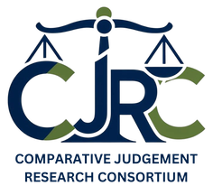

Welcome to the Comparative Judgement Research Consortium!

This international group brings together researchers and practitioners from diverse fields including mathematics, education, psychology, and computer science. We are dedicated to advancing the understanding and application of comparative judgement through collaborative research and practice. The group was founded in 2023 by [Ian Jones](https://www.lboro.ac.uk/departments/maths-education/staff/ian-jones/), [Marie-Josee Bisson](https://www.dmu.ac.uk/about-dmu/academic-staff/health-and-life-sciences/marie-josee-bisson/marie-josee-bisson.aspx), and [Rowland Seymour](https://www.birmingham.ac.uk/staff/profiles/maths/seymour-rowland). 

Join us for regular meetings, take part in our online reading group, access our comprehensive resource lists, and connect with a vibrant community committed to innovation and excellence in comparative judgement. Explore our site to learn more about our work and how you can get involved!

## Joining the Group
To join our group send an email to LISTSERV@JISCMAIL.AC.UK with the body SUBSCRIBE COMPARATIVE-JUDGEMENT _FirstName LastName_. Or you can sign up on the [JISCMail website](http://www.jiscmail.ac.uk/COMPARATIVE-JUDGEMENT). 

## What is Comparative Judgement
Comparative judgment is a method used in assessment and evaluation to compare and rank different items or performances based on their perceived quality or merit. Instead of assigning absolute scores or grades to individual items, comparative judgment involves comparing pairs of items and determining which is better or of higher quality.

Here's a simplified explanation of how comparative judgment works:

Pairs of Items: Assessors are presented with pairs of items to compare. These items could be student essays, project proposals, artwork, or any other type of work that needs evaluation.

Decision Making: The assessors then make judgments about which item in each pair is better or more desirable based on certain criteria. The criteria can be predetermined or emerge from the assessors' expertise in the subject matter.

Iterative Process: This process is repeated multiple times, with assessors comparing different pairs of items. The software or system organizing the judgments collects the data on the comparisons made by each assessor.

Ranking: The final result is generated by analyzing the collective judgments. Items are ranked based on how often they were chosen as better in the comparisons.

One advantage of comparative judgment is that it allows for a more nuanced and reliable assessment by leveraging the human ability to make qualitative distinctions. It can be especially useful when evaluating complex or subjective tasks where assigning numerical scores may be challenging.

There are both manual and automated ways to implement comparative judgment. Manual methods involve people making the comparisons, while automated systems use algorithms to analyze the data and derive rankings. Automated systems can efficiently handle large-scale assessments, making comparative judgment a versatile approach in various fields, including education, art, and professional evaluations.

## Acknowledgements
This group was set up through a National Centre for Research Methods Special Interest Group grant and then sustained with support from the London Mathematical Society, Bath Spa University, and a UKRI Future Leaders Fellowship [MR/X034992/1]. 
